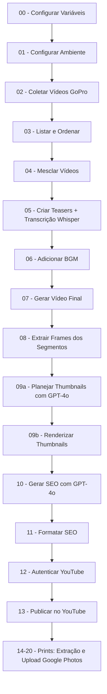

# FFmpeg Colab - Pipeline Completo de Edição e Publicação de Vídeos

Pipeline automatizado para edição de vídeos e publicação no YouTube usando Google Colab. Este notebook integra FFmpeg, OpenAI (GPT-4o + Whisper), YouTube API e Google Photos API para processar vídeos desde o download até a publicação com SEO otimizado, thumbnails profissionais e extração inteligente de frames.

## 📋 Índice

- [Visão Geral](#visão-geral)
- [Recursos](#recursos)
- [Requisitos](#requisitos)
- [Estrutura do Pipeline](#estrutura-do-pipeline)
- [Configuração](#configuração)
- [Uso](#uso)
- [Estrutura de Pastas](#estrutura-de-pastas)
- [Tecnologias Utilizadas](#tecnologias-utilizadas)

## 🎯 Visão Geral

Este notebook do Google Colab automatiza todo o fluxo de trabalho de produção de vídeos, desde o download de arquivos da GoPro até a publicação no YouTube com metadados SEO otimizados, thumbnails personalizadas e upload de frames para o Google Photos. Pode ser executado diretamente no navegador via Colab ou localmente no VS Code usando a extensão Google Colab como kernel.

## ✨ Recursos

### 1. **Configuração de Ambiente**
- Instalação automática de Chrome, FFmpeg e ExifTool
- Configuração de variáveis de ambiente
- Montagem do Google Drive
- Gerenciamento de estrutura de pastas

### 2. **Download de Vídeos**
- Download automático de vídeos compartilhados via GoPro
- Suporte para qualidade original (4K) ou compactada
- Detecção automática de interface em português/inglês
- Download headless com Selenium

### 3. **Processamento de Vídeos**
- **Listagem e Ordenação**: Organiza vídeos por nome
- **Mesclagem**: Concatena múltiplos vídeos com keyframes otimizados
- **Teasers**: Cria teasers com transcrição via OpenAI Whisper
- **Música de Fundo**: Adiciona BGM direto do Google Drive
- **Finalização**: Gera vídeo final com copy puro

### 4. **Extração de Frames**
- Extração rápida e precisa de frames em 2 estágios (seek rápido + preciso)
- Processamento paralelizado com ThreadPoolExecutor
- Geração de manifests JSON com metadados

### 5. **Geração de Thumbnails**
- Criação de thumbnails profissionais com:
  - Fundo com contraste/nitidez aumentados e efeito vignette
  - Ícone de localização (pin) laranja com texto
  - Mini-fotos rotacionadas (-6° e +6°) com bordas arredondadas e sombra
  - Headlines em caixas brancas/laranjas
  - Barra xadrez inferior (checkerboard)
- 3 variações de texto por thumbnail geradas via GPT-4o
- Layout fixo e consistente
- JPEG progressivo (qualidade 96)

### 6. **SEO Automatizado**
- Geração de metadados via OpenAI GPT-4o:
  - Título otimizado (máx. 100 caracteres, com emoji e MAIÚSCULAS)
  - Descrição em 3 parágrafos com curiosidades
  - 10 hashtags relevantes
  - Tags de pesquisa (~20 tags, máx. 500 caracteres)
  - Categoria do YouTube (padrão: Travel & Events)
- Formatação automática com links do canal (Wise, Filmora, Suno, Opus Clip)
- Validação de JSON com retry e backoff exponencial

### 7. **Publicação no YouTube**
- Autenticação OAuth2 robusta
- Upload de vídeo com metadados
- Aplicação automática de thumbnail (otimizada para ≤2MB)
- Suporte para múltiplos níveis de privacidade (public/unlisted/private)
- Log detalhado de uploads

### 8. **Prints - Extração Inteligente de Frames**
- Análise de qualidade com filtros:
  - Nitidez (Laplacian variance > 100)
  - Detecção de faces (Haarcascade)
  - Saturação HSV
  - Complexidade de bordas (Canny)
  - Rejeição de frames similares (correlação histograma > 0.95)
- Modos de amostragem: por segundo, por frame ou manual
- Detecção automática de ambiente (TPU/GPU/CPU)
- Upload automático para Google Photos em álbum datado

## 📦 Requisitos

### APIs e Chaves
- **OpenAI API Key**: Para transcrição (Whisper) e geração de conteúdo (GPT-4o)
- **Google Cloud Credentials**: Para autenticação YouTube e Google Photos (client_secret JSON)

### Dependências Python
```
selenium
webdriver-manager
openai>=1.30.0
google-auth-oauthlib>=1.2.0
google-api-python-client>=2.0.0
google-auth-httplib2
Pillow
piexif
requests
gdown
opencv-python-headless
scikit-image
```

### Ferramentas do Sistema
- Google Chrome (headless)
- FFmpeg 4.4+
- ExifTool 12.40+

## 🔄 Estrutura do Pipeline



## ⚙️ Configuração

### 1. Variáveis de Ambiente (Célula 00)

```python
# URL compartilhada da GoPro
GOPRO_URL_DEFAULT = "https://gopro.com/v/..."

# Modo de download: "original" ou "compressed"
os.environ["GOPRO_DL_MODE"] = "compressed"

# Modelos OpenAI
OPENAI_WHISPER = "whisper-1"
OPENAI_GPT = "gpt-4o"

# BGM (vazio = seleção automática do Drive)
os.environ["BGM_FILENAME"] = ""
os.environ["BGM_VOLUME_DB"] = "-3.0"
```

### 2. Opções de Configuração (Célula 01)

```python
MAKE_COMPAT_LINKS = False  # Criar atalhos legados
HARD_RESET = True          # Limpar pastas ao iniciar
```

## 🚀 Uso

### Execução Passo a Passo

1. **Configure as variáveis** (Célula 00)
2. **Execute a configuração do ambiente** (Célula 01) — instala Chrome, FFmpeg, ExifTool e monta Drive
3. **Faça download dos vídeos da GoPro** (Célula 02) — via Selenium headless
4. **Liste e ordene os arquivos** (Célula 03) — metadados com FFprobe + ExifTool
5. **Mescle os vídeos** (Célula 04) — copy puro com alinhamento de keyframes
6. **Crie teasers com transcrição** (Célula 05) — Whisper + GPT-4o seleciona ~60s
7. **Adicione música de fundo** (Célula 06) — BGM automática ou manual do Drive
8. **Gere o vídeo final** (Célula 07) — Teaser+BGM + Vídeo Completo
9. **Extraia frames** (Célula 08) — frames dos segmentos do teaser
10. **Crie thumbnails** (Células 09a + 09b) — plano GPT-4o + renderização
11. **Gere SEO com OpenAI** (Célula 10) — título, descrição, tags, hashtags
12. **Formate os metadados** (Célula 11) — validação e links do canal
13. **Autentique no YouTube** (Célula 12)
14. **Publique o vídeo** (Célula 13) — upload + thumbnail + metadados
15. **Extraia prints** (Células 14-20) — análise de qualidade + upload Google Photos

### Parâmetros Principais

#### Teaser (Célula 05)
```python
TARGET_TEASER_S = 60.0   # Duração alvo do teaser (segundos)
MIN_CLIP_S = 5.0         # Duração mínima por clip
MAX_CLIP_S = 10.0        # Duração máxima por clip
MIN_GAP_S = 5.0          # Gap mínimo entre clips
PRE_ROLL_S = 0.25        # Margem de início (respiro antes do keyframe)
POST_ROLL_S = 0.60       # Margem de fim (respiro após o keyframe)
```

#### Thumbnails (Células 09a-09b)
```python
# Definir textos para as 3 variações
variants_texts = [
    {
        "location_title": "Aeroporto de Congonhas",
        "location_subtitle": "Rumo a Curitiba",
        "head_top": "Voo Tranquilo",
        "head_bottom": "Aventura em Curitiba"
    },
    # ... mais 2 variações
]
```

#### Upload YouTube (Célula 13)
```python
VIDEO_NAME = "20251117_134644_FINAL.mp4"
SEO_INDEX = 1           # Qual bloco de SEO usar (1-3)
THUMB_INDEX = 1         # Qual thumbnail usar (1-3)
PRIVACY_STATUS = "unlisted"  # public | unlisted | private
```

## 📁 Estrutura de Pastas

```
/content/
├── 01 - Downloads/          # Vídeos baixados da GoPro
├── 02 - Mesclado/           # Vídeos concatenados (copy puro)
├── 03 - Teasers/            # Teasers + transcrições + BGM
│   └── *_teaser_openai.json # Seleção de segmentos GPT-4o
├── 04 - Assets/             # Arquivos temporários (BGM processada)
├── 05 - Final/              # Vídeo finalizado (Teaser+BGM+Full)
├── 06 - Frames/             # Frames extraídos dos segmentos
│   └── *_frames_manifest.json
├── 07 - Thumbnails/         # Thumbnails geradas (3 variações)
│   ├── *_thumbs_right_plan.json
│   └── *_thumbs_right_manifest.json
├── 08 - SEO/                # Metadados SEO (JSON)
│   ├── *_seo.json           # Resposta bruta OpenAI
│   └── *_seo_formatados.json
├── 09 - Youtube/            # Credenciais e logs de upload
│   ├── api-youtube/         # client_secret JSON
│   └── token/               # token.json OAuth
├── 10 - Frames/             # Frames interessantes (análise de qualidade)
└── 99-Drive/                # Google Drive montado
```

## 🛠️ Tecnologias Utilizadas

### Processamento de Vídeo
- **FFmpeg**: Mesclagem, corte, transcodificação
- **ExifTool**: Metadados de arquivos

### Automação Web
- **Selenium**: Download automatizado da GoPro
- **Chrome WebDriver**: Navegação headless

### Inteligência Artificial
- **OpenAI Whisper**: Transcrição de áudio (chunked para vídeos >3min)
- **OpenAI GPT-4o**: Seleção de teasers, textos de thumbnails, geração de SEO

### Processamento de Imagens
- **Pillow (PIL)**: Criação de thumbnails personalizadas
- **OpenCV**: Análise de qualidade de frames (nitidez, faces, saturação, bordas)
- **scikit-image**: Filtros de imagem
- **piexif**: Leitura/escrita de metadados EXIF
- **Fontes Google**: Calistoga (headlines)

### APIs e Autenticação
- **YouTube Data API v3**: Upload de vídeos e thumbnails
- **Google Photos API**: Upload de frames para álbuns datados
- **Google Drive API**: Armazenamento de credenciais e assets
- **Google OAuth2**: Autenticação segura

### Linguagem e Ambiente
- **Python 3**: Linguagem principal
- **Google Colab**: Ambiente de execução
- **Jupyter Notebook**: Interface

## 📝 Observações

### Limitações
- A API oficial do YouTube Data API v3 não suporta teste A/B de thumbnails (apenas 1 thumbnail por vídeo)
- Downloads da GoPro dependem da estrutura HTML do site (pode quebrar se mudarem a interface)
- Transcrição via Whisper consome créditos da OpenAI

### Boas Práticas
- Sempre execute a célula de configuração (01) antes de outras células
- Mantenha o Google Drive montado durante todo o processo
- Verifique os manifests JSON gerados em cada etapa
- Teste uploads no modo "unlisted" antes de publicar

### Segurança
- **NUNCA** commite arquivos com API keys no Git
- A OpenAI API Key é carregada do Google Drive montado
- Use variáveis de ambiente ou arquivos JSON locais
- O token OAuth é salvo em `/content/09 - Youtube/token/token.json`
- Arquivos em `/content/` são temporários no Colab (apagados após sessão)

## 🖥️ Uso via VS Code (Local)

É possível rodar o notebook localmente no VS Code usando o kernel do Google Colab:

1. Instale a extensão **Google Colab** no VS Code
2. Abra o arquivo `.ipynb`
3. Clique em **Select Kernel** → **Colab** → **Auto Connect** (ou **New Colab Server** para GPU)
4. Selecione **Python 3 (ipykernel)**
5. Execute as células normalmente — o código roda nos servidores do Google

## 📄 Licença

Este projeto é fornecido "como está" para uso pessoal e educacional.

## 🤝 Contribuições

Sinta-se à vontade para:
- Reportar bugs
- Sugerir melhorias
- Adaptar para seu fluxo de trabalho

## 📧 Contato

Para dúvidas sobre o notebook, consulte os comentários nas células ou a documentação das APIs utilizadas.

---

**Desenvolvido para automatizar o fluxo de produção de vídeos do YouTube** 🎬
