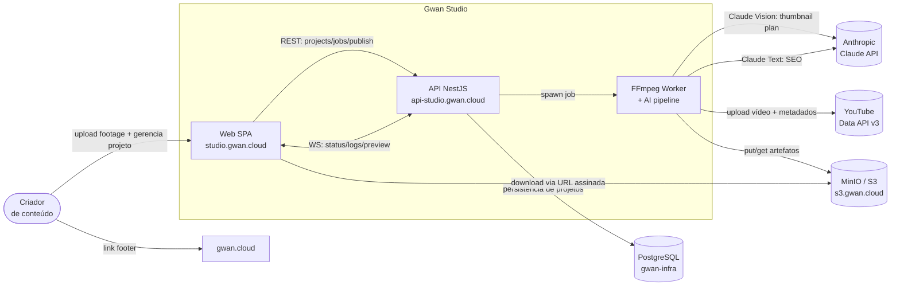
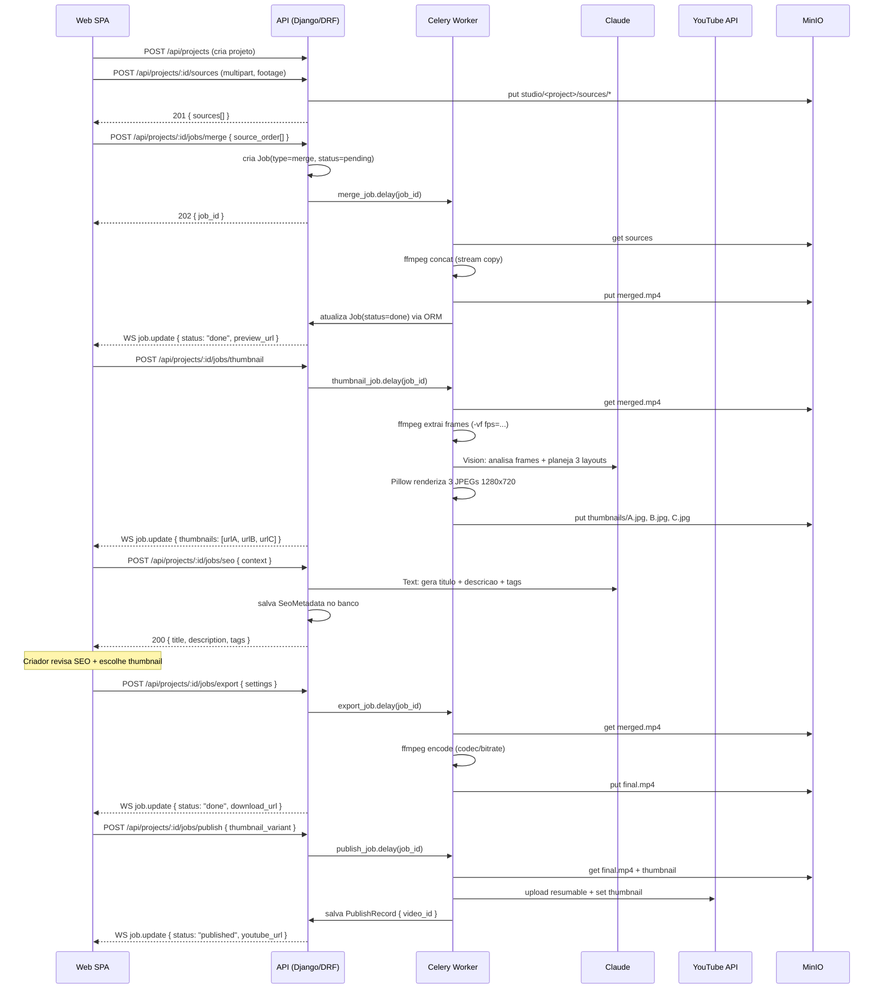

# Contexto do sistema (C4 nível 1–2) — Gwan Studio

## Contexto (C4 Nível 1)

## Containers (C4 Nível 2)

| Container | Tecnologia | Responsabilidade | Domínio |
|-----------|-----------|------------------|---------|
| **Web** | React 18 + Vite + TS + shadcn/ui | Upload de footage, gerenciamento de projeto, acompanhamento de jobs, aprovação de thumbnails, SEO editor, publicação | `studio.gwan.cloud` |
| **API** | **Django 5.2 LTS** + DRF 3.x + Django Channels 4.x (ASGI) | Projetos, sources, jobs, thumbnails, SEO, publicação YouTube; despacha tasks Celery; repassa eventos via WebSocket | `api-studio.gwan.cloud` |
| **Celery Worker** | Celery 5 + ffmpeg-python / subprocess | Executa jobs pesados (merge, export, frames, thumbnails, upload YouTube) — processo separado, sem bloquear a API | container `celery-worker` |
| **Redis** | Redis 7 (infra GWAN compartilhada) | Broker Celery + channel layer Django Channels (pub/sub WebSocket) | `cache.gwan.cloud` |
| **Claude** | Anthropic API (externo) | Vision: analisa frames e planeja layout de thumbnail. Text: gera título, descrição e tags SEO | `ANTHROPIC_API_KEY` — só no backend |
| **YouTube Data API** | Google API v3 (externo) | Upload de vídeo, gestão de metadados | OAuth 2.0 — refresh token só no backend |
| **MinIO** | S3-compatible (infra GWAN) | Workspace do projeto, sources, merged video, exported video, thumbnails; URLs assinadas | `s3.gwan.cloud` (compartilhado, bucket `studio`) |
| **PostgreSQL** | PostgreSQL (infra GWAN) | Projetos, sources, jobs, thumbnails, SEO metadata, OAuth tokens (Django ORM) | `postgres.gwan.cloud` (compartilhado) |

## Limites e integrações

- **MinIO e PostgreSQL são infra compartilhada** (P0 do gwan-infra) — Studio usa bucket `studio` e schema/db dedicado.
- **Chaves de IA e OAuth no backend apenas** — nunca expostas ao browser.
- **Celery Worker executa fora do processo Django** — FS efêmero por job, não bloqueia a API.
- **Download** ocorre direto do MinIO via URL assinada — a API não faz proxy de binários.
- **OAuth tokens do YouTube** são persistidos criptografados no banco — o criador autentica uma vez por projeto.
- **Celery + Redis na Fase A** (fila durável por design — jobs sobrevivem a restarts desde o início).

## Fluxo de sequência (produção de vídeo ponta a ponta)

## Ambientes

| Ambiente | Web | API | Worker | MinIO | Claude/YouTube |
|----------|-----|-----|--------|-------|----------------|
| **Dev local** (slot 18) | `localhost:5191` | `localhost:3018/api` | processo local (ffmpeg no PATH) | infra compartilhada ou MinIO local | chaves dev |
| **Produção** | `studio.gwan.cloud` | `api-studio.gwan.cloud/api` | worker dedicado | `s3.gwan.cloud` (bucket `studio`) | chaves prod |
