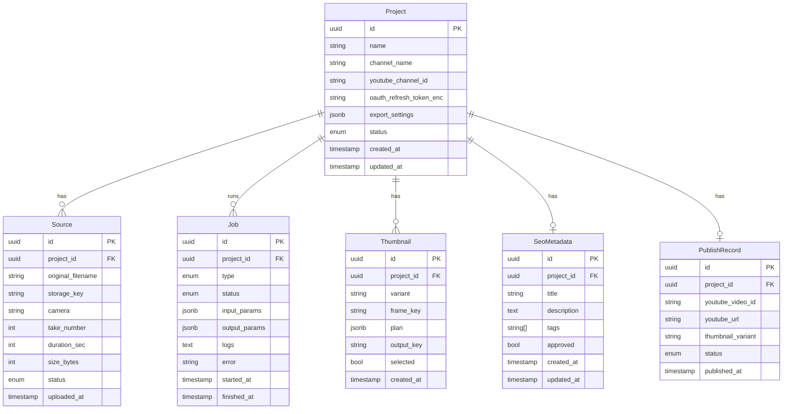

# Modelo de domínio — Gwan Studio

## Diagrama de entidades



## Entidades

### Project

Unidade central de produção. Cada vídeo publicado = 1 projeto.

| Campo | Tipo | Descrição |
|-------|------|-----------|
| `id` | UUID | Identificador único |
| `name` | string | Nome legível (ex.: "EP 42 - Tour do Cabreuva") |
| `channel_name` | string | Nome do canal YouTube alvo |
| `youtube_channel_id` | string | ID do canal (ex.: `UCxxxxxxx`) |
| `oauth_refresh_token_enc` | string | Refresh token OAuth Google (criptografado em repouso) |
| `export_settings` | JSONB | `{ codec, bitrate, resolution, fps }` — padrões sobrescrevíveis por projeto |
| `status` | enum | Ver estados abaixo |
| `created_at` | timestamp | — |
| `updated_at` | timestamp | — |

**Estados do projeto:**

```
draft → sources_ready → merging → merged → exporting → exported → publishing → published
                                                                              ↘ failed
```

### Source

Arquivo de vídeo bruto enviado pelo criador.

| Campo | Tipo | Descrição |
|-------|------|-----------|
| `id` | UUID | — |
| `project_id` | UUID | — |
| `original_filename` | string | Nome do arquivo original |
| `storage_key` | string | Chave MinIO: `studio/<proj_id>/sources/<filename>` |
| `camera` | string | Identificador da câmera (ex.: `cam-a`, `gopro`) — opcional |
| `take_number` | int | Número do take — opcional |
| `duration_sec` | int | Duração em segundos (extraída no upload) |
| `size_bytes` | int | Tamanho original |
| `status` | enum | `uploading` \| `ready` \| `error` |
| `uploaded_at` | timestamp | — |

### Job

Unidade de processamento assíncrono. Um projeto gera múltiplos jobs em sequência.

| Campo | Tipo | Descrição |
|-------|------|-----------|
| `id` | UUID | — |
| `project_id` | UUID | — |
| `type` | enum | `merge` \| `export` \| `thumbnail` \| `seo` \| `publish` |
| `status` | enum | `pending` \| `running` \| `done` \| `failed` |
| `input_params` | JSONB | Parâmetros de entrada específicos do tipo (ex.: `{ source_order: [] }` para merge) |
| `output_params` | JSONB | Resultado: chaves MinIO, IDs externos, métricas |
| `logs` | text | Log incremental do worker (acumulado, enviado via WS) |
| `error` | string | Mensagem de erro se `failed` |
| `started_at` | timestamp | — |
| `finished_at` | timestamp | — |

**Tipos de job e seus `output_params`:**

| Tipo | `output_params` |
|------|----------------|
| `merge` | `{ merged_key, duration_sec }` |
| `export` | `{ final_key, size_bytes, duration_sec }` |
| `thumbnail` | `{ variants: { A: key, B: key, C: key }, frame_keys: [] }` |
| `seo` | `{ title, description, tags[] }` |
| `publish` | `{ video_id, youtube_url, thumbnail_variant }` |

### Thumbnail

Uma variante de thumbnail gerada para o projeto.

| Campo | Tipo | Descrição |
|-------|------|-----------|
| `id` | UUID | — |
| `project_id` | UUID | — |
| `variant` | string | `A`, `B` ou `C` |
| `frame_key` | string | Chave MinIO do frame extraído usado como base |
| `plan` | JSONB | Plano do Claude Vision: `{ description, text_overlay, color_palette, focus_area }` |
| `output_key` | string | Chave MinIO do PNG final: `studio/<proj_id>/thumbnails/<variant>.png` |
| `selected` | bool | `true` para a variante escolhida para publicação |
| `created_at` | timestamp | — |

### SeoMetadata

Metadados de SEO gerados pelo Claude (um por projeto, editável).

| Campo | Tipo | Descrição |
|-------|------|-----------|
| `id` | UUID | — |
| `project_id` | UUID | — |
| `title` | string | Título do vídeo (max 100 chars) |
| `description` | text | Descrição completa (max 5000 chars) |
| `tags` | string[] | Tags (max 500 chars total no YouTube) |
| `approved` | bool | `true` após criador confirmar o SEO antes do upload |
| `created_at` | timestamp | — |
| `updated_at` | timestamp | — |

### PublishRecord

Registro de publicação no YouTube.

| Campo | Tipo | Descrição |
|-------|------|-----------|
| `id` | UUID | — |
| `project_id` | UUID | — |
| `youtube_video_id` | string | ID do vídeo (`dQw4w9WgXcQ`) |
| `youtube_url` | string | URL completa |
| `thumbnail_variant` | string | Variante escolhida (`A`, `B` ou `C`) |
| `status` | enum | `pending` \| `uploading` \| `published` \| `failed` |
| `published_at` | timestamp | — |

## Value Objects

### ExportSettings

```typescript
interface ExportSettings {
  codec: 'copy' | 'h264' | 'h265';       // default: 'copy' (stream copy, sem re-encode)
  bitrate?: string;                         // ex.: '8M' (só se codec != 'copy')
  resolution?: '1080p' | '4k' | 'source'; // default: 'source'
  fps?: number;                             // ex.: 30 (só se codec != 'copy')
}
```

### ThumbnailPlan

```typescript
interface ThumbnailPlan {
  description: string;      // Claude descreve o layout em prosa
  text_overlay: string;     // Texto sugerido para o thumbnail
  color_palette: string[];  // Cores hex dominantes
  focus_area: 'face' | 'action' | 'landscape' | 'product';
  font_style: 'bold' | 'clean' | 'dramatic';
}
```

## Invariantes de domínio

- `Project.status` só avança (não volta) exceto para `failed`, que pode ser reprocessado criando um novo job.
- Um projeto só pode ter 1 `PublishRecord` com `status = 'published'`.
- `SeoMetadata.approved` deve ser `true` antes de `POST /api/projects/:id/publish`.
- `Thumbnail.selected = true` deve existir exatamente em 1 variante antes de publicar.
- Refresh token YouTube (`oauth_refresh_token_enc`) é sempre criptografado — nunca retornado nas respostas da API.
- Sources com `status = 'error'` não participam do merge sem intervenção do criador.
