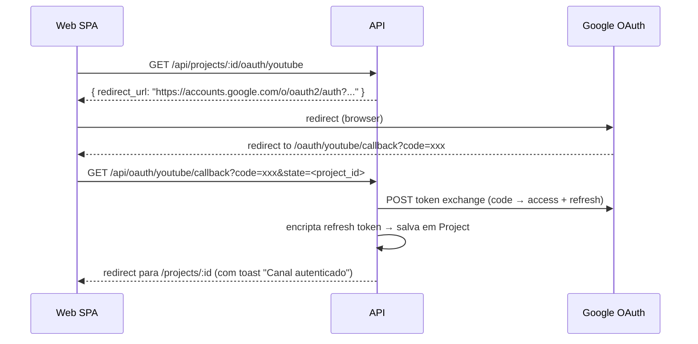

# F07 — Publicação no YouTube

## Objetivo

Fazer upload do `final.mp4` no YouTube com metadados SEO e thumbnail escolhida, usando a YouTube Data API v3 via OAuth 2.0.

## Pré-condições (validadas antes do upload)

1. `Project.status = 'exported'` (final.mp4 existe no MinIO)
2. `SeoMetadata.approved = true`
3. `Thumbnail` com `selected = true` existe
4. `Project.oauth_refresh_token_enc` não vazio (usuário autenticou o canal)

## Requisitos

| ID | Requisito |
|----|-----------|
| REQ-F07-01 | `GET /api/projects/:id/oauth/youtube` inicia fluxo OAuth 2.0 (redirect para Google Consent) |
| REQ-F07-02 | `GET /api/oauth/youtube/callback` troca code por tokens; persiste refresh token criptografado |
| REQ-F07-03 | `POST /api/projects/:id/jobs/publish` inicia job de publicação |
| REQ-F07-04 | Worker baixa `final.mp4` do MinIO e faz upload via YouTube resumable upload API |
| REQ-F07-05 | Worker define thumbnail via `thumbnails.set` com a variante selecionada |
| REQ-F07-06 | `video_id` e `youtube_url` são salvos em `PublishRecord` |
| REQ-F07-07 | Status do projeto avança para `published` |
| REQ-F07-08 | `GET /api/projects/:id/publish` retorna `{ video_id, youtube_url, status }` |

## Regras de negócio

| ID | Regra |
|----|-------|
| RN-F07-01 | Refresh token é persistido criptografado com AES-256 (`OAUTH_ENCRYPTION_KEY`) — nunca retornado pela API |
| RN-F07-02 | Access token é obtido por `google-auth-library` usando o refresh token — válido por 1h, não persistido |
| RN-F07-03 | Upload usa [YouTube Resumable Upload](https://developers.google.com/youtube/v3/guides/using_resumable_upload) para suportar arquivos grandes (>5 MB) |
| RN-F07-04 | Progresso do upload (%) é emitido via WebSocket |
| RN-F07-05 | Vídeo é criado como `privado` por padrão — criador o torna público manualmente no YouTube Studio |
| RN-F07-06 | Thumbnail deve ser JPEG ≤ 2 MB (YouTube limit) — worker redimensiona se necessário |
| RN-F07-07 | Em caso de falha no upload, o job fica `failed` e pode ser re-tentado (não duplica o vídeo — re-usa `PublishRecord.resumable_upload_uri` se disponível) |

## Fluxo OAuth

## UI (Web)

- Seção "Publicar" no detalhe do projeto.
- Se canal não autenticado: botão "Conectar canal YouTube" → inicia OAuth.
- Se canal autenticado: badge "Canal: {channel_name}", botão "Desconectar".
- Checklist de pré-condições: Export ✓, SEO aprovado ✓, Thumbnail escolhida ✓.
- Botão "Publicar no YouTube" (habilitado apenas quando todas as pré-condições OK).
- Durante upload: barra de progresso com % + log stream.
- Concluído: link direto para o vídeo no YouTube.
- Nota: "Vídeo criado como Privado — torne público no YouTube Studio quando pronto."
